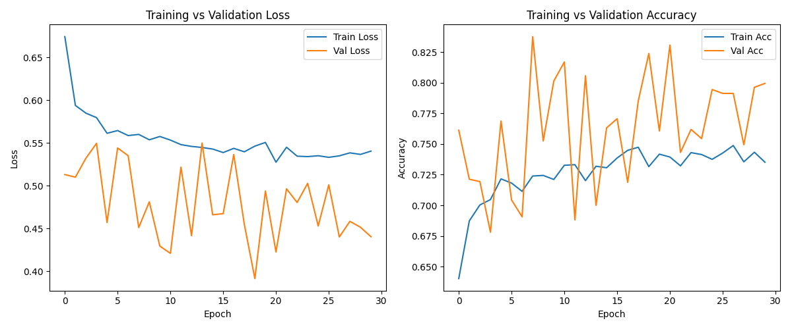
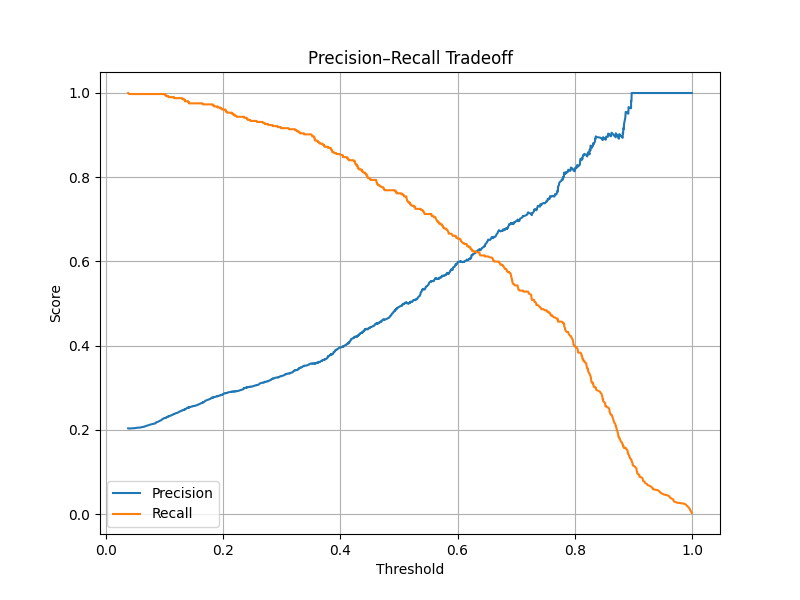

# 📊 Bank Churn Prediction API

A **FastAPI** service that predicts customer churn (whether a customer is likely to leave the bank) using a tuned **Artificial Neural Network (ANN)** model.  
The model is trained and tracked with **MLflow**, and served in **Production** stage via the MLflow Model Registry.

---

## 🚀 Features
- **FastAPI** REST API with endpoints for:
  - `POST /predict` → single customer prediction
  - `POST /predict_batch` → batch predictions
  - `GET /health` → health check
- **Preprocessing pipeline** (drop irrelevant IDs, encode categorical, scale numeric) mirrors training.
- **Model versioning** with MLflow Model Registry.
- **Automated CI** with GitHub Actions.

---

## ⚡ Quickstart

### 1. Clone the repo
```bash
git clone https://github.com/<your-username>/bank-churn-api.git
cd bank-churn-api

### 2. Create virtual environment
```bash
python -m venv .venv
source .venv/bin/activate   # Linux/Mac
.\.venv\Scripts\Activate.ps1  # Windows PowerShell

### 3. Install dependencies
```bash
pip install -r requirements.txt

### 4. Run the API
```bash
uvicorn api.main:app --reload --port 8000

## Example request for single prediction
POST /predict

{
  "CreditScore": 619,
  "Geography": "France",
  "Gender": "Female",
  "Age": 42,
  "Tenure": 2,
  "Balance": 0.0,
  "NumOfProducts": 1,
  "HasCrCard": 1,
  "IsActiveMember": 1,
  "EstimatedSalary": 101348.88
}

---

## 📊 Results

### Training Curves


### Precision–Recall Tradeoff



## 🤖 Model Training

-Model is tuned with KerasTuner (tune_ann.py).
-Metrics, hyperparameters, and artifacts are logged with MLflow.
-Best model is registered in the MLflow Model Registry as Churn_ANN.

## 📜 License
MIT License © 2025

